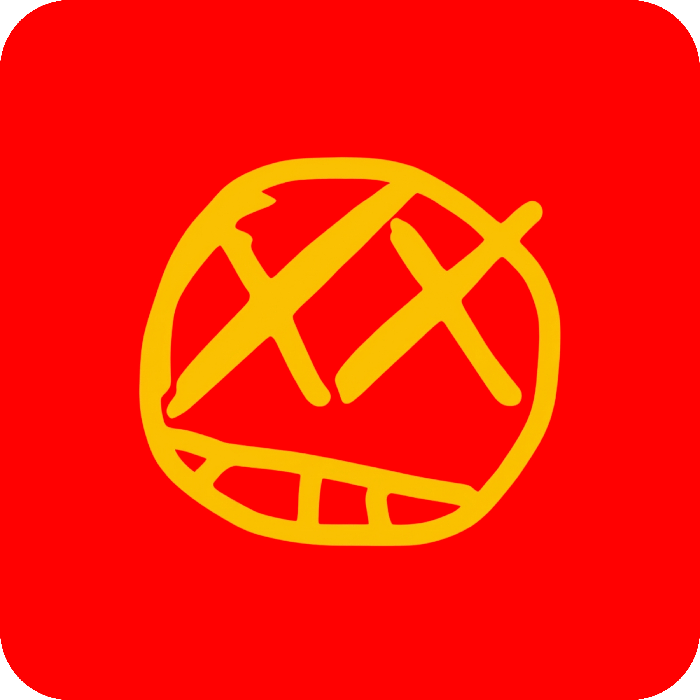

<!-- ============================================================ -->
<!-- HEADER: Logo + Título + Navegação                             -->
<!-- ============================================================ -->

  

<h1 align="center">
  
</h1>

  
  
  
  

 

<!-- ============================================================ -->
<!-- SOBRE                                                         -->
<!-- ============================================================ -->

  
<h2>👾 About DEADSMILE</h2>

  

    <strong>DEADSMILE</strong> is an independent game studio founded by <a href="https://github.com/luxjson">Lucas (luxjson)</a>. 
    We create <strong>narrative‑driven games</strong>, interactive experiences, and experimental digital art. 
    Our mission is to blend <em>storytelling</em>, <em>game design</em>, and <em>clean code</em> to deliver 
    unforgettable moments — even if they give you chills.
  

  <ul>
    <li>🎮 <strong>Genre:</strong> Horror, Psychological, Experimental</li>
    <li>🛠️ <strong>Stack:</strong> JavaScript, Web APIs, Canvas, Node.js, React</li>
    <li>🌍 <strong>Location:</strong> São Paulo, Brazil</li>
    <li>📅 <strong>Founded:</strong> 2024</li>
  </ul>

  <blockquote>
    “We don’t make games — we craft worlds that stay with you long after the screen goes dark.”
  </blockquote>

 

<!-- ============================================================ -->
<!-- PROJETOS EM DESTAQUE                                          -->
<!-- ============================================================ -->

  
<h2>📦 Featured Projects</h2>

  

    
    
  

  

    
  

  

    
  

 

<!-- ============================================================ -->
<!-- TECNOLOGIAS                                                   -->
<!-- ============================================================ -->

  
<h2>🧰 Tech Stack</h2>

  <h3>🎮 Game Development</h3>
  

    
    
    
    
  

  <h3>💻 Full Stack</h3>
  

    
    
    
    
    
  

  <h3>⚙️ Tools</h3>
  

    
    
    
    
    
  

 

<!-- ============================================================ -->
<!-- ESTATÍSTICAS                                                  -->
<!-- ============================================================ -->

  
<h2>📊 GitHub Stats</h2>

  

    
  

  

    
    
  

  

    
  

 

<!-- ============================================================ -->
<!-- RODAPÉ                                                        -->
<!-- ============================================================ -->

  
  
  
  

  <strong>DEADSMILE</strong> · 2026 · <em>“Stay curious, stay scared.”</em>

